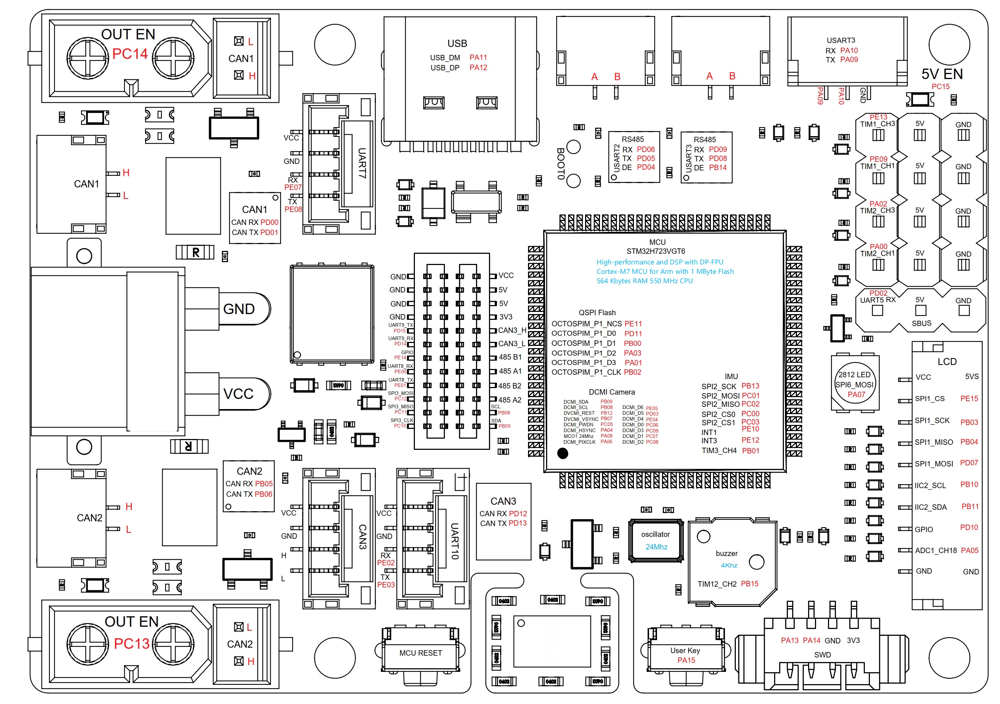

# DM MC02 Board Base

The pin configurations are shown in the diagram below:

## Available Peripherals

#### GPIO
- PA7 Output - LED

#### UART
- UART2
- UART5 (Remote default, RX only)
- UART10
- UART7

#### CAN
- FDCAN1
- FDCAN2
- FDCAN3

#### PWM
- TIM12/CH_2